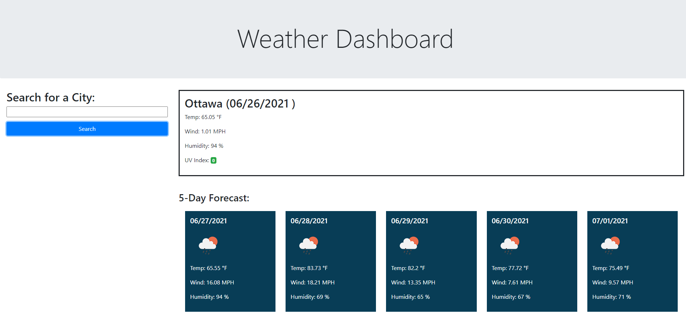

# Weather Dashboard

## Purpose
An applicatuon that allows the user to add important events to a daily planner so that they can manage their time effectively.Each time block is color-coded to indicate whether it is in the past (grey), present (red), or future (green).

## Built With
* HTML
* CSS
* Javascript/JQuery
* Bootstrap
* Iconic
* Moment js
* Open Weather (https://openweathermap.org/)

## Website
https://matildabakare.github.io/weather-dashboard/

## Screenshots

## Contribution
Made by Matilda Bakare
